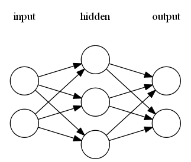

[](https://travis-ci.org/codeplea/genann)


# Genann

Genann is a minimal, well-tested library for training and using feedforward
artificial neural networks (ANN) in C. Its primary focus is on being simple,
fast, reliable, and hackable. It achieves this by providing only the necessary
functions and little extra.

## Features

- **C99 with no dependencies**.
- Contained in a single source code and header file.
- Simple.
- Fast and thread-safe.
- Easily extendible.
- Implements backpropagation training.
- *Compatible with alternative training methods* (classic optimization, genetic algorithms, etc)
- Includes examples and test suite.
- Released under the zlib license - free for nearly any use.

## Building

Genann is self-contained in two files: `genann.c` and `genann.h`. To use Genann, simply add those two files to your project.

## Example Code

Four example programs are included with the source code.

- [`example1.c`](./example1.c) - Trains an ANN on the XOR function using backpropagation.
- [`example2.c`](./example2.c) - Trains an ANN on the XOR function using random search.
- [`example3.c`](./example3.c) - Loads and runs an ANN from a file.
- [`example4.c`](./example4.c) - Trains an ANN on the [IRIS data-set](https://archive.ics.uci.edu/ml/datasets/Iris) using backpropagation.

## Quick Example

We create an ANN taking 2 inputs, having 1 layer of 3 hidden neurons, and
providing 2 outputs. It has the following structure:



We then train it on a set of labeled data using backpropagation and ask it to
predict on a test data point:

```C
#include "genann.h"

/* Not shown, loading your training and test data. */
double **training_data_input, **training_data_output, **test_data_input;

/* New network with 2 inputs,
 * 1 hidden layer of 3 neurons each,
 * and 2 outputs. */
genann *ann = genann_init(2, 1, 3, 2);

/* Learn on the training set. */
for (i = 0; i < 300; ++i) {
    for (j = 0; j < 100; ++j)
        genann_train(ann, training_data_input[j], training_data_output[j], 0.1);
}

/* Run the network and see what it predicts. */
double const *prediction = genann_run(ann, test_data_input[0]);
printf("Output for the first test data point is: %f, %f\n", prediction[0], prediction[1]);

genann_free(ann);
```

This example is to show API usage, it is not showing good machine learning
techniques. In a real application you would likely want to learn on the test
data in a random order. You would also want to monitor the learning to prevent
over-fitting.


## Usage

### Creating and Freeing ANNs
```C
genann *genann_init(int inputs, int hidden_layers, int hidden, int outputs);
genann *genann_copy(genann const *ann);
void genann_free(genann *ann);
```

Creating a new ANN is done with the `genann_init()` function. Its arguments
are the number of inputs, the number of hidden layers, the number of neurons in
each hidden layer, and the number of outputs. It returns a `genann` struct pointer.

Calling `genann_copy()` will create a deep-copy of an existing `genann` struct.

Call `genann_free()` when you're finished with an ANN returned by `genann_init()`.


### Training ANNs
```C
void genann_train(genann const *ann, double const *inputs,
        double const *desired_outputs, double learning_rate);
```

`genann_train()` will preform one update using standard backpropogation. It
should be called by passing in an array of inputs, an array of expected outputs,
and a learning rate. See *example1.c* for an example of learning with
backpropogation.

A primary design goal of Genann was to store all the network weights in one
contigious block of memory. This makes it easy and efficient to train the
network weights using direct-search numeric optimization algorthims,
such as [Hill Climbing](https://en.wikipedia.org/wiki/Hill_climbing),
[the Genetic Algorithm](https://en.wikipedia.org/wiki/Genetic_algorithm), [Simulated
Annealing](https://en.wikipedia.org/wiki/Simulated_annealing), etc.
These methods can be used by searching on the ANN's weights directly.
Every `genann` struct contains the members `int total_weights;` and
`double *weight;`.  `*weight` points to an array of `total_weights`
size which contains all weights used by the ANN. See *example2.c* for
an example of training using random hill climbing search.

### Saving and Loading ANNs

```C
genann *genann_read(FILE *in);
void genann_write(genann const *ann, FILE *out);
```
 
Genann provides the `genann_read()` and `genann_write()` functions for loading or saving an ANN in a text-based format.

### Evaluating

```C
double const *genann_run(genann const *ann, double const *inputs);
```

Call `genann_run()` on a trained ANN to run a feed-forward pass on a given set of inputs. `genann_run()`
will provide a pointer to the array of predicted outputs (of `ann->outputs` length).


## Hints

- All functions start with `genann_`.
- The code is simple. Dig in and change things.

## Extra Resources

The [comp.ai.neural-nets
FAQ](http://www.faqs.org/faqs/ai-faq/neural-nets/part1/) is an excellent
resource for an introduction to artificial neural networks.

If you need an even smaller neural network library, check out the excellent single-hidden-layer library [tinn](https://github.com/glouw/tinn).

If you're looking for a heavier, more opinionated neural network library in C,
I recommend the [FANN library](http://leenissen.dk/fann/wp/). Another
good library is Peter van Rossum's [Lightweight Neural
Network](http://lwneuralnet.sourceforge.net/), which despite its name, is
heavier and has more features than Genann.
