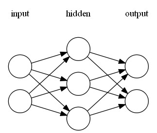

[](https://travis-ci.org/codeplea/genann)


# Genann

Genann 是一个精简、经过良好测试的 C 语言库，用于训练和使用前馈人工神经网络（ANN）。它的核心设计目标是简单、快速、可靠和易于修改。通过只提供必要的功能来实现这一目标。

## 特性

- **基于 C99 标准，无外部依赖**。
- 仅包含在单个源代码文件和头文件中。
- 简单易用。
- 快速且线程安全。
- 易于扩展。
- 实现了反向传播训练算法。
- *兼容其他训练方法*（经典优化算法、遗传算法等）
- 包含示例程序和测试套件。
- 使用 zlib 许可证发布 - 几乎可用于任何用途。

## 构建

Genann 自包含在两个文件中：`genann.c` 和 `genann.h`。要使用 Genann，只需将这两个文件添加到你的项目中即可。

## 示例代码

源代码中包含四个示例程序：

- [`example1.c`](./example1.c) - 使用反向传播训练神经网络学习 XOR 函数。
- [`example2.c`](./example2.c) - 使用随机搜索训练神经网络学习 XOR 函数。
- [`example3.c`](./example3.c) - 从文件加载并运行神经网络。
- [`example4.c`](./example4.c) - 使用反向传播在 [IRIS 数据集](https://archive.ics.uci.edu/ml/datasets/Iris) 上训练神经网络。

## 快速示例

我们创建一个神经网络，它接收 2 个输入，具有 1 层包含 3 个隐藏神经元的隐藏层，并提供 2 个输出。它的结构如下：



然后我们使用反向传播在一组标注数据上训练它，并让它预测测试数据点：

```C
#include "genann.h"

/* 此处省略加载训练和测试数据的代码 */
double **training_data_input, **training_data_output, **test_data_input;

/* 创建新网络：
 * 2 个输入，
 * 1 个隐藏层，每层 3 个神经元，
 * 2 个输出。 */
genann *ann = genann_init(2, 1, 3, 2);

/* 在训练集上学习 */
for (i = 0; i < 300; ++i) {
    for (j = 0; j < 100; ++j)
        genann_train(ann, training_data_input[j], training_data_output[j], 0.1);
}

/* 运行网络，查看预测结果 */
double const *prediction = genann_run(ann, test_data_input[0]);
printf("第一个测试数据点的输出是: %f, %f\n", prediction[0], prediction[1]);

genann_free(ann);
```

这个示例只是展示 API 的用法，并不代表良好的机器学习实践。在实际应用中，你可能希望以随机顺序学习测试数据。你还需要监控学习过程以防止过拟合。

## 使用方法

### 创建和释放神经网络

```C
genann *genann_init(int inputs, int hidden_layers, int hidden, int outputs);
genann *genann_copy(genann const *ann);
void genann_free(genann *ann);
```

使用 `genann_init()` 函数创建新的神经网络。它的参数是输入数量、隐藏层数量、每个隐藏层的神经元数量，以及输出数量。它返回一个 `genann` 结构体指针。

调用 `genann_copy()` 将创建现有 `genann` 结构体的深拷贝。

当你使用完 `genann_init()` 返回的神经网络后，调用 `genann_free()` 释放内存。

### 训练神经网络

```C
void genann_train(genann const *ann, double const *inputs,
        double const *desired_outputs, double learning_rate);
```

`genann_train()` 使用标准反向传播执行一次更新。调用时需要传入输入数组、期望输出数组和学习率。参考 *example1.c* 查看使用反向传播学习的示例。

Genann 的一个主要设计目标是将所有网络权重存储在一个连续的内存块中。这使得使用直接搜索数值优化算法（如 [爬山法](https://zh.wikipedia.org/wiki/%E7%88%AC%E5%B1%B1%E6%B3%95)、[遗传算法](https://zh.wikipedia.org/wiki/%E9%81%97%E4%BC%A0%E7%AE%97%E6%B3%95)、[模拟退火](https://zh.wikipedia.org/wiki/%E6%A8%A1%E6%8B%9F%E9%80%80%E7%81%AB) 等）来训练网络权重变得简单高效。

这些方法可以通过直接搜索神经网络的权重来使用。每个 `genann` 结构体都包含成员 `int total_weights;` 和 `double *weight;`。`*weight` 指向一个大小为 `total_weights` 的数组，其中包含神经网络使用的所有权重。参考 *example2.c* 查看使用随机爬山搜索训练的示例。

### 保存和加载神经网络

```C
genann *genann_read(FILE *in);
void genann_write(genann const *ann, FILE *out);
```

Genann 提供 `genann_read()` 和 `genann_write()` 函数，用于以基于文本的格式加载或保存神经网络。

### 评估（预测）

```C
double const *genann_run(genann const *ann, double const *inputs);
```

在训练好的神经网络上调用 `genann_run()` 来对给定的输入执行前向传播。`genann_run()` 将返回指向预测输出数组的指针（长度为 `ann->outputs`）。

## 提示

- 所有函数都以 `genann_` 开头。
- 代码很简单。深入研究并修改它们。

## 额外资源

[comp.ai.neural-nets FAQ](http://www.faqs.org/faqs/ai-faq/neural-nets/part1/) 是一份优秀的人工神经网络入门资源。

如果你需要一个更小的神经网络库，可以参考优秀的单隐藏层库 [tinn](https://github.com/glouw/tinn)。

如果你在寻找一个更重量级、更有主见的 C 语言神经网络库，我推荐 [FANN 库](http://leenissen.dk/fann/wp/)。另一个好的库是 Peter van Rossum 的 [轻量级神经网络](http://lwneuralnet.sourceforge.net/)，尽管名字如此，它比 Genann 更重量级且功能更多。
